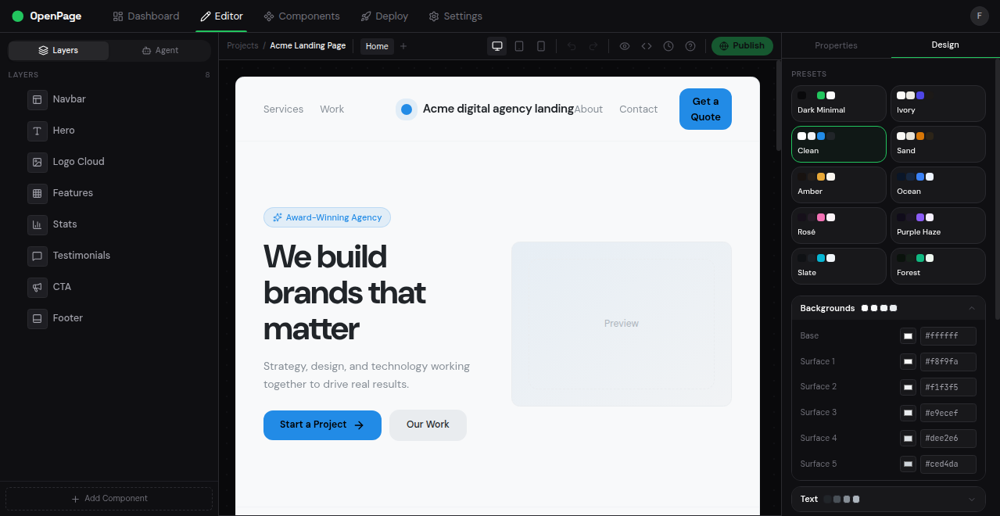

# OpenPage: Open-Source AI Website Builder

**OpenPage is an open-source website builder that uses JSON as the single source of truth.** It combines a Framer-like visual drag-and-drop editor with AI-powered site generation, producing websites that are fully described by a structured, typed JSON config. Unlike code generators (Lovable, v0, Bolt) that produce fragile output, or visual editors (Framer, Webflow) that lock you into proprietary formats, OpenPage gives both humans and AI agents a shared, predictable interface to build and edit websites.

[](LICENSE)
[](https://www.typescriptlang.org/)
[](https://react.dev/)
[](https://tailwindcss.com/)

**[Live Demo](https://openpage-phi.vercel.app)** · [Quick Start](#quick-start) · [Blocks](#blocks) · [API](#api) · [Themes](#themes) · [FAQ](#faq)

<p align="center">
  
</p>

## Features

- **Visual drag-and-drop editor** with real-time preview, block reordering, and inline editing
- **AI website generation** from a text prompt via Gemini (POST a prompt, get back a complete site)
- **19 block types, 42 layout variants** covering navbars, heroes, features, pricing, testimonials, FAQs, and more
- **10 built-in theme presets** with full customization (colors, fonts, border radius, spacing)
- **One-click HTML export** producing a standalone, self-contained file with zero runtime dependencies
- **JSON-first architecture** where every edit (visual or AI) produces clean, diffable, version-controllable JSON
- **Self-hosted and open source** under the MIT license, with no vendor lock-in
- **9,300+ lines of TypeScript**, built on React 19, Tailwind CSS v4, Zustand, and Vite 7
- **~5 second production builds**, 176 KB gzipped bundle

## Why OpenPage

Code generation is fragile: LLMs hallucinate imports, break builds, produce unmergeable diffs. Visual editors lock you into proprietary formats that AI agents can't read or edit programmatically.

**JSON-first architecture** solves both problems. A website is described entirely by a typed JSON document. The visual editor reads and writes this JSON. The AI endpoint generates it. The renderer turns it into a live page. Every mutation, whether from a human dragging a block or an agent calling the API, produces the same structured, diffable output.

- **Not another code generator.** No hallucinated imports, no broken builds, no unmergeable diffs.
- **Not a proprietary visual tool.** JSON is portable, diffable, and agent-friendly.
- **Self-hosted.** Run it on your own infrastructure. You own your data, your config, your output.

## How It Works

```
┌─────────────────┐      ┌──────────────┐      ┌───────────────┐
│  Visual Editor  │◄────►│  JSON Config  │◄────►│   Agent API   │
│  (drag & drop)  │      │ (source of   │      │  (POST /api/  │
│                 │      │   truth)     │      │   generate)   │
└─────────────────┘      └──────┬───────┘      └───────────────┘
                                │
                         ┌──────┴───────┐
                         │   Renderer   │
                         └──────┬───────┘
                                │
                    ┌───────────┴───────────┐
                    │   Deployed Site       │
                    │   (standalone HTML)   │
                    └───────────────────────┘
```

### The JSON Config

Every website in OpenPage is a single JSON document containing blocks and a theme. This is a complete, working site config:

```json
{
  "name": "My Startup",
  "theme": {
    "bg0": "#09090b",
    "text0": "#fafafa",
    "accent": "#22c55e",
    "fontSans": "Inter",
    "fontDisplay": "Space Grotesk",
    "radius": 8
  },
  "blocks": [
    {
      "id": "nav-1",
      "type": "navbar",
      "variant": "default",
      "props": {
        "logo": "Acme",
        "links": ["Features", "Pricing", "Docs"],
        "ctaText": "Get Started"
      }
    },
    {
      "id": "hero-1",
      "type": "hero",
      "variant": "centered",
      "props": {
        "badge": "Now in beta",
        "headline": "Ship websites in minutes",
        "subheadline": "JSON config, visual editor, AI generation.",
        "primaryCta": "Start Building"
      }
    },
    {
      "id": "features-1",
      "type": "features",
      "variant": "grid",
      "props": {
        "title": "Everything you need",
        "items": [
          { "icon": "Zap", "title": "Fast", "description": "Sub-second renders" },
          { "icon": "Shield", "title": "Reliable", "description": "Typed JSON schema" },
          { "icon": "Bot", "title": "AI-native", "description": "Agents edit JSON directly" }
        ]
      }
    },
    {
      "id": "footer-1",
      "type": "footer",
      "variant": "minimal",
      "props": { "copyright": "2026 Acme Inc." }
    }
  ]
}
```

Change the JSON, the site updates. No build step, no compilation, no broken imports.

## Blocks

OpenPage ships with 19 block types and 42 layout variants. Every block has a typed TypeScript schema, multiple visual variants, and automatic theme integration:

| Block | Variants | Description |
|-------|----------|-------------|
| `navbar` | default, centered | Navigation bar with logo, links, CTA |
| `hero` | centered, split, gradient, minimal | Above-the-fold hero section |
| `features` | grid, list, alternating | Feature cards or list items |
| `pricing` | simple, comparison | Pricing tiers with feature lists |
| `cta` | simple, split | Call-to-action sections |
| `footer` | simple, multi-column, minimal | Site footer with links |
| `testimonials` | cards, carousel, spotlight | Customer quotes and ratings |
| `stats` | grid, bar, counter | Metrics and numbers |
| `faq` | accordion | Expandable Q&A |
| `team` | grid | Team member cards |
| `contact` | form | Contact form |
| `newsletter` | simple | Email signup |
| `logocloud` | default | Company logo grid |
| `content` | prose, columns, highlight | Rich text (markdown) |
| `image` | hero-image, side-by-side, grid | Image layouts |
| `video` | youtube, vimeo | Embedded video |
| `gallery` | grid, masonry | Image gallery |
| `divider` | line, space, dots | Visual separators |
| `banner` | ribbon, bar | Announcement banners |

## Quick Start

```bash
git clone https://github.com/buildingopen/openpage.git
cd openpage
npm install
npm run dev
```

The editor opens at `http://localhost:5173`. Create a site, drag blocks, edit content, export to HTML.

### AI Generation

To enable AI-powered website generation, set your Gemini API key:

```bash
cp .env.example .env
# Add your GEMINI_API_KEY
```

Then deploy to Vercel (the AI endpoint runs as a serverless function):

```bash
vercel
```

### API

`POST /api/generate` with a text prompt, get back a complete website as structured JSON:

```bash
curl -X POST https://your-app.vercel.app/api/generate \
  -H "Content-Type: application/json" \
  -d '{"prompt": "Landing page for a developer tools startup"}'
```

Returns a full `SiteConfig` with theme, blocks, and content. The JSON is ready to render in the editor, export to HTML, or store in version control.

## Export

OpenPage exports websites as standalone HTML files. The output is completely self-contained: inlined theme styles, Tailwind CSS via CDN, Google Fonts. No build tools, no runtime dependencies, no framework lock-in. Open the file in any browser or deploy it to any static hosting provider (Vercel, Netlify, GitHub Pages, S3, or your own server).

## Themes

10 built-in theme presets: Dark Minimal, Ivory, Clean, Sand, Amber, Ocean, Rose, Purple Haze, Slate, Forest. Every theme controls background colors, text colors, accent color, font families (body, display, mono), border radius, and border colors via CSS custom properties. Every block automatically adapts to the active theme. Define custom themes by overriding any subset of the theme config.

## Comparison

How OpenPage compares to popular website builders and AI site generators:

| | Framer | Webflow | Lovable | v0 | Bolt | OpenPage |
|---|---|---|---|---|---|---|
| Source of truth | Proprietary | Proprietary | Generated code | Generated code | Generated code | **JSON config** |
| Agent-editable | No | No | Prompt only | Prompt only | Prompt only | **Structured API** |
| Human-editable | Visual editor | Visual editor | Code/prompt | Code | Code/prompt | **Visual + JSON** |
| Predictable edits | Yes | Yes | No | No | No | **Yes** |
| Version control | Limited | Limited | Git (messy diffs) | No | Git (messy diffs) | **Git (clean diffs)** |
| Self-hosted | No | No | No | No | No | **Yes** |
| Open source | No | No | No | No | No | **Yes (MIT)** |
| Export to HTML | No | Limited | Yes | No | Yes | **Yes (standalone)** |

## Tech Stack

- [React 19](https://react.dev/) + [TypeScript 5.9](https://www.typescriptlang.org/)
- [Vite 7](https://vite.dev/) (build tool)
- [Tailwind CSS v4](https://tailwindcss.com/) (styling)
- [Zustand](https://zustand.docs.pmnd.rs/) + [Immer](https://immerjs.github.io/immer/) (state management with undo/redo)
- [@dnd-kit](https://dndkit.com/) (drag and drop)
- [Lucide](https://lucide.dev/) (icons)
- [Gemini](https://ai.google.dev/) (AI generation backend)

## FAQ

### What is OpenPage?

OpenPage is an open-source website builder that uses a JSON-first architecture. Instead of generating code or storing designs in a proprietary format, every website is described by a single structured JSON document. A visual drag-and-drop editor lets you build pages by arranging blocks, while an AI endpoint can generate complete site configs from a text prompt. Both interfaces read and write the same JSON, making edits predictable, diffable, and version-controllable.

### What is a JSON-first website builder?

A JSON-first website builder stores the entire website as structured JSON data rather than as source code or in a proprietary visual format. This means every element of the site (blocks, content, theme, layout) is represented as typed, structured data. The advantage: AI agents can make surgical edits via API, humans can edit visually, and the output is always clean and predictable. No hallucinated imports, no merge conflicts, no broken builds.

### How is OpenPage different from Framer?

Framer is a proprietary visual editor. OpenPage is open-source and self-hosted. The key architectural difference is that OpenPage uses JSON as the source of truth, making sites programmatically editable via API. Framer sites live in Framer's cloud; OpenPage sites are JSON files you own and can store anywhere.

### How is OpenPage different from Lovable or v0?

Lovable and v0 generate source code from prompts. Code generation is inherently fragile: LLMs hallucinate imports, produce inconsistent output, and create diffs that are hard to review or merge. OpenPage generates structured JSON instead of code, making AI output predictable and deterministic. The JSON schema enforces validity, so every generated config produces a working site.

### Can I self-host OpenPage?

Yes. OpenPage is fully self-hostable. Clone the repo, run `npm install && npm run dev`, and the editor runs locally. The AI generation endpoint can be deployed as a Vercel serverless function or adapted to any backend. Exported sites are standalone HTML files that can be hosted anywhere.

### What AI model does OpenPage use?

OpenPage uses Google's Gemini model for AI site generation. The `/api/generate` endpoint sends a text prompt to Gemini with a detailed system prompt describing the block schema, and receives back a complete site config as structured JSON. You can swap in any LLM that supports structured/JSON output by modifying the API endpoint.

### Is OpenPage free?

Yes. OpenPage is released under the MIT license. You can use it for personal projects, commercial projects, or as a starting point for your own website builder. There are no usage limits, no paid tiers, and no telemetry.

## Contributing

PRs welcome. Before submitting:

```bash
npm run lint    # ESLint
npm run build   # TypeScript + Vite build
npm run test    # Vitest
```

## License

[MIT](LICENSE)
